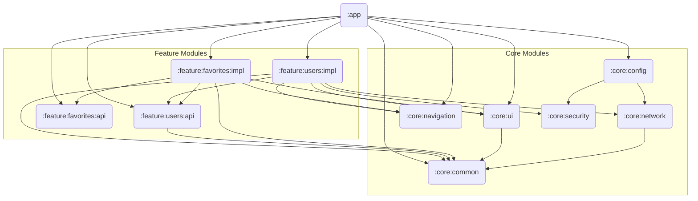

# Module Graph

```mermaid
graph TD
    app(":app")

    subgraph feature["Feature Modules"]
        fu_api(":feature:users:api")
        fu_impl(":feature:users:impl")
        ff_api(":feature:favorites:api")
        ff_impl(":feature:favorites:impl")
    end

    subgraph core["Core Modules"]
        core_common(":core:common")
        core_ui(":core:ui")
        core_nav(":core:navigation")
        core_net(":core:network")
        core_sec(":core:security")
        core_cfg(":core:config")
    end

    %% app dependencies
    app --> fu_api
    app --> fu_impl
    app --> ff_api
    app --> ff_impl
    app --> core_ui
    app --> core_nav
    app --> core_cfg
    app --> core_common

    %% feature:users:impl dependencies
    fu_impl --> fu_api
    fu_impl --> core_ui
    fu_impl --> core_nav
    fu_impl --> core_net
    fu_impl --> core_sec
    fu_impl --> core_common

    %% feature:users:api dependencies
    fu_api --> core_common

    %% feature:favorites:impl dependencies
    ff_impl --> ff_api
    ff_impl --> fu_api
    ff_impl --> core_ui
    ff_impl --> core_nav
    ff_impl --> core_common

    %% core:ui dependencies
    core_ui --> core_common

    %% core:network dependencies
    core_net --> core_common

    %% core:config dependencies
    core_cfg --> core_net
    core_cfg --> core_sec
```
