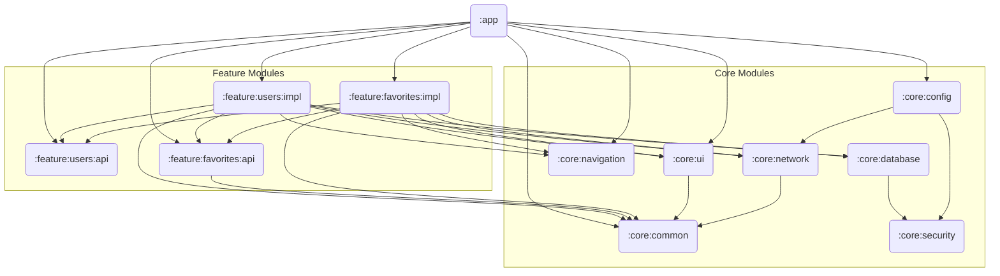

# GitHub Users

An Android application for browsing GitHub users and their details, with the ability to save favorites for quick access.

## Features

### User List

- Browse all GitHub users with infinite scroll pagination (20 items per page).
- Offline support — previously loaded users are cached locally and accessible without a network connection.
- Mark and unmark any user as a favorite directly from the list.


&nbsp;

- If loading the next page fails, an inline retry option is shown.


### User Details

- View profile information: avatar, location, follower and following counts, and GitHub profile link.
- Add or remove the user from favorites with a single tap.


### Favorites

- View all saved favorite users in a dedicated screen.
- Remove favorites with a confirmation dialog to prevent accidental deletion.


### Theme

- Supports [Dark Mode](https://developer.android.com/develop/ui/views/theming/darktheme)


&nbsp;

- Supports [Dynamic Color](https://developer.android.com/develop/ui/views/theming/dynamic-colors) (Android 12+)


### Adaptive Layouts

- Supports [adaptive layouts](https://developer.android.com/develop/ui/compose/layouts/adaptive) for both User List and User Details on large screens and foldables.


### Deep Links

- User List: `https://github-users.tyme.com/users`

  ```bash
  adb shell am start -a android.intent.action.VIEW -d "https://github-users.tyme.com/users"
  ```

- User Details: `https://github-users.tyme.com/users/{username}`

  ```bash
  adb shell am start -a android.intent.action.VIEW -d "https://github-users.tyme.com/users/huuphuoc1396"
  ```

> **Note:** `https://github-users.tyme.com` is a demo domain that has not been verified. You must enable it manually in the app's supported links settings.


---

## Architecture

The project follows **Clean Architecture** in a **multi-module** setup. Each feature is split into an `api` module (public contract) and an `impl` module (private implementation), with shared infrastructure extracted into `core` modules.

### Module Map

```
:app                          ← wires everything together, owns AppNavigatorImpl and DI bindings
core/
  common/                     ← shared Kotlin contracts (models, dispatchers, Result helpers) — no Android, no Hilt
  ui/                         ← AppTheme, shared Compose components (AppButton, LoadingScreen, ErrorScreen, etc.)
  navigation/                 ← AppNavigator interface, NavigationIntent, Route, NavigationEffects
  network/                    ← Retrofit, OkHttpClient, safeApiCall, ApiException — owns NetworkModule
  database/                   ← AppDatabase, all DAOs, Room migrations, SQLCipher setup — owns DatabaseModule
  security/                   ← CMake/C++ key provider, SSL certificate handling
  config/                     ← build-flavor-aware configuration (base URLs, feature flags)
feature/
  users/
    api/                      ← UserDetailsDestination (nav contract); UserModel exposed via core:common
    impl/                     ← UserRepository, UserApi, UserRemoteMediator, UserListViewModel, UserDetailsViewModel
  favorites/
    api/                      ← FavoriteRepository interface, AddFavoriteUseCase, RemoveFavoriteUseCase,
                                 IsFavoriteUseCase, GetFavoritesUseCase
    impl/                     ← FavoriteRepositoryImpl, FavoritesViewModel
```

### Dependency Graph



### Dependency Direction

```
:app → feature:x:impl → feature:x:api → core:*
:app → feature:x:api
feature:x:impl → feature:y:api        ← allowed (public contract only)
feature:x:impl → feature:y:impl       ← forbidden
core:* → feature:*                    ← forbidden
```

### Layer Responsibilities

| Layer | Location | Responsibility |
| --- | --- | --- |
| Presentation | `feature:x:impl/presentation/` | ViewModel, UiState, Screen composables |
| Domain | `feature:x:api/domain/` or `feature:x:impl/domain/` | Use cases, repository interfaces, domain models |
| Data | `feature:x:impl/data/` | Repository impls, Retrofit API, Room DAOs, mappers |
| Infrastructure | `core:network`, `core:database`, `core:security` | Network stack, database, encryption |

### Error Handling

- **Write operations**: Repositories return `Result<Unit>`. Errors are caught at the repository boundary with `runCatching {}` and surfaced to the ViewModel via `.onFailure {}`.
- **Reactive flows**: Repositories return `Flow<T>`. ViewModels apply `.catch {}` before `.stateIn()` to prevent silent Flow termination on errors.

---

## Tech Stack

### UI

- [Jetpack Compose](https://developer.android.com/jetpack/compose) — declarative UI, no Fragments or XML layouts
- [Material 3](https://m3.material.io/) with dynamic color and dark mode support
- [Adaptive layouts](https://developer.android.com/develop/ui/compose/layouts/adaptive) for large screens
- [Coil 3](https://coil-kt.github.io/coil/) — async image loading

### Navigation

- [Navigation Compose](https://developer.android.com/jetpack/compose/navigation) with [Kotlin Serialization](https://github.com/Kotlin/kotlinx.serialization) for type-safe destinations

### Dependency Injection

- [Hilt](https://developer.android.com/training/dependency-injection/hilt-android)

### Network

- [Retrofit](https://square.github.io/retrofit/) + [OkHttp](https://square.github.io/okhttp/) + [Gson](https://github.com/google/gson)
- Custom `safeApiCall` wrapper maps HTTP errors to typed `ApiException`
- Features contribute interceptors via `@IntoSet` — `NetworkModule` is never modified per feature

### Database & Persistence

- [Room](https://developer.android.com/training/data-storage/room) + [Paging 3](https://developer.android.com/topic/libraries/architecture/paging/v3-overview) for paginated user list with offline cache
- [SQLCipher](https://github.com/sqlcipher/sqlcipher-android) for encrypted local storage (disabled in `dev`, enabled in `stag`/`prod`)
- [DataStore](https://developer.android.com/topic/libraries/architecture/datastore) for key-value persistence

### Async

- [Kotlin Coroutines](https://kotlinlang.org/docs/coroutines-overview.html) + [Flow](https://developer.android.com/kotlin/flow)

### Security

- **SSL Pinning** — certificate pinned in `core:security` via OkHttp `CertificatePinner`
- **Database encryption** — SQLCipher, key managed by `core:security`
- **Native key storage** — sensitive keys stored in C++ via [CMake](https://developer.android.com/ndk/guides/cmake), harder to decompile than JVM bytecode
- **R8** — minification and obfuscation enabled in release builds

### Debugging & Quality

- [LeakCanary](https://square.github.io/leakcanary/) — memory leak detection in debug builds
- [Timber](https://github.com/JakeWharton/timber) — structured logging

---

## Testing

Tests use [JUnit 4](https://junit.org/junit4/), [MockK](https://mockk.io/), [Turbine](https://github.com/cashapp/turbine), [Kotest](https://kotest.io/), and [Robolectric](https://robolectric.org/).

Coverage is measured with [Kover](https://github.com/Kotlin/kotlinx-kover) across all modules. Generate an HTML report:

```bash
./gradlew koverHtmlReportDevDebug
```


Test coverage targets:

| Area | What is tested |
| --- | --- |
| ViewModels | All user interactions, UiState transitions, error paths |
| Use cases | Delegation to repository, Result propagation |
| Repositories | DAO/API calls, `runCatching` failure paths |
| Mappers | Domain ↔ UI model conversions |

---

## Product Flavors

| Flavor | App ID suffix | DB encryption | Notes |
| --- | --- | --- | --- |
| `dev` | `.dev` | disabled | For local development and inspection |
| `stag` | `.stag` | enabled | Mirrors production security settings |
| `prod` | _(none)_ | enabled | Production release |

---

## Get Started

### Prerequisites

- Android Studio Ladybug or newer
- JDK 11+
- Android Gradle Plugin 8.6.1+
- Kotlin 2.0.20+
- [NDK and CMake](https://developer.android.com/studio/projects/install-ndk#default-version) (required for `core:security`)

### SDK

| Property | Value |
| --- |-------|
| `minSdk` | 28    |
| `targetSdk` | 36    |
| `compileSdk` | 36    |

### Installation

1. Clone the repository:
   ```bash
   git clone https://github.com/huuphuoc1396/android-github-users.git
   ```
2. Open the `android-github-users/` directory in Android Studio.
3. Copy `credentials.cpp` into `core/security/cpp/`.
4. Select a Build Variant (e.g. `devDebug`).
5. Run the `:app` configuration.

---

## License

This project is licensed under the MIT License — see the [LICENSE](LICENSE) file for details.

## Contact

For any inquiries, reach out to [Phuoc Bui](https://github.com/huuphuoc1396).
